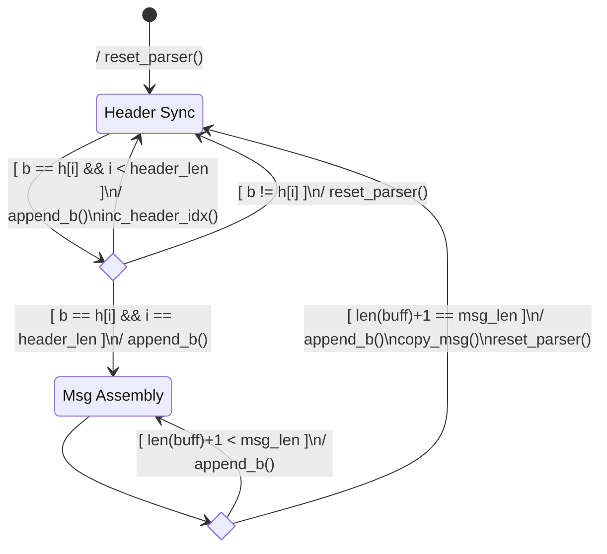

# Multimeter BLE connectivity
Utilities for connecting to the QM1578 bluetooth enabled multimeter.

## Objectives and Disclaimer - Not for production use
This has been a journey of discovery into Bluetooth LE connectivity and use of asynchronus IO.
The code uses the excellent [Bleak](https://bleak.readthedocs.io/en/latest/) cross-platform bluetooth 
library, but only executed on MacOS.  You're mileage may vary.

The device includes a Windows only app and iPhone App, but this connects on MacOS abd provides more control over
data collection and analysis.
The driving objective is to progress the software to a package that can be used for realtime visualisation, probably
with the help of a timeseries database.

## Shout outs
Thanks to Mike McCauley for sharing analysis of the QM1578 comms protocol - a major time saver.
https://www.airspayce.org/mikem/QM1578/protocol.txt 

## Installation
Install for local use by cloning the repo and installing dependencies using poetry.
In addition the `mm` CLI will also be installed into the virtual environment.
```bash
poetry install
poetry shell
```

## Phase 1: Command line interface
A command line interface (CLI) can be used to inspect and monitor the digital multi-meter over a Bluetooth connection.

| command | Description |
| ------- | ----------- |
| `mm ble find` | Scan for a transmitting Bluetooth QM1578 or compatible multi-meter |
| `mm ble scan` | Scan for all available Bluetooth devices, by name |
| `mm ble monitor` | Find and listen to the device readings in human readable (json) format |
| `mm ble listen` | Find and listen to the device readings in binary (hex) format |
| `mm ble snoop` | Find and listen to the raw Bluetooth datagram stream, including visbility of fragmented payloads |

```bash
# list available commands
$ mm ble --help

# monitor device readings
$ mm ble monitor

{'timestamp': '2023-01-08 22:27:04.535463+11:00', 'mode': 'VDC', 'value': '12.18', 'units': 'V'}
{'timestamp': '2023-01-08 22:27:04.716754+11:00', 'mode': 'VDC', 'value': '12.18', 'units': 'V'}
{'timestamp': '2023-01-08 22:27:04.850479+11:00', 'mode': 'VDC', 'value': '12.18', 'units': 'V'}
{'timestamp': '2023-01-08 22:27:05.030702+11:00', 'mode': 'VDC', 'value': '12.18', 'units': 'V'}
{'timestamp': '2023-01-08 22:27:05.166696+11:00', 'mode': 'VDC', 'value': '12.18', 'units': 'V'}
{'timestamp': '2023-01-08 22:27:05.346759+11:00', 'mode': 'VDC', 'value': '12.18', 'units': 'V'}
{'timestamp': '2023-01-08 22:27:05.480503+11:00', 'mode': 'VDC', 'value': '12.17', 'units': 'V'}
```

## Observations
* The device uses the Bluetooth LE notification protocol to push messages from the device the the reciever (client).  
While messages are expected to a be fixed 15 byte length, the messages can be fragmented across more than one notification.  The parser effectively assumes ordered delivery of datagrams, but will ignore most unexpected input.
* Data transmission when in Continuity Test mode seems to transmit one or two messages and and disconnects.  Some 
reconnect logic has been added to account for spinning the dial and shifting modes.
* The datagram message rates vary depending on mode and readings.  Timestamps should be used for ordering and 
time based analysis over assuming a specific sampling rate.

## datagram processing
Summary of the datagram processing for re-assembly into device readings.

