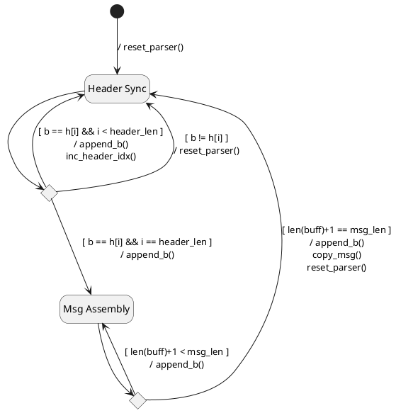

# Multimeter BLE connectivity
Utilities for connecting to the bluetooth enabled multimeter.

## datagram processing

```plantuml
@startuml BLE message re-assembly
hide empty description

state sync as "Header Sync"
state h_char <<choice>>
state assembly as "Msg Assembly"
state d_char <<choice>>

[*] --> sync : / reset_parser()
sync --> h_char
h_char --> assembly : [ b == h[i] && i == header_len ]\n/ append_b()
h_char --> sync : [ b == h[i] && i < header_len ]\n/ append_b()\ninc_header_idx()
h_char --> sync : [ b != h[i] ]\n/ reset_parser()

assembly --> d_char
d_char --> assembly : [ len(buff)+1 < msg_len ]\n/ append_b()
d_char --> sync : [ len(buff)+1 == msg_len ]\n/ append_b()\ncopy_msg()\nreset_parser()

' assembly --> [*]

@enduml
```